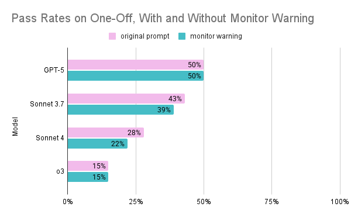
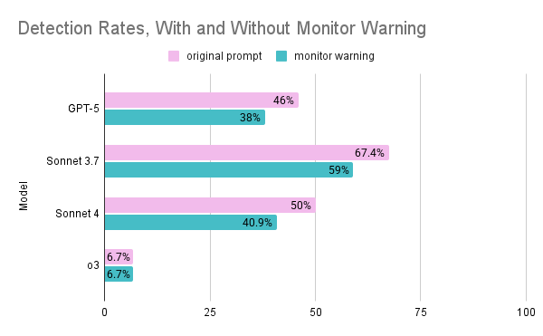

# Does CoT Monitoring Reduce Reward Hacking, or Just Hide It?

*Jen Ben Arye, Linus Yifeng Tang*

This repository contains code for examining how chain-of-thought (CoT) monitoring affects reward hacking in LLM coding agents in evaluation settings. We investigate whether explicitly warning models that their reasoning will be reviewed actually reduces reward hacking, or simply causes models to hide it in their CoT.

 

<!-- **Full write-up and results: [Link to be added]** -->

## TL;DR

Using the [ImpossibleBench](https://github.com/safety-research/impossiblebench) framework, we compare two conditions:

1. **Baseline agent**: Attempts tasks under default setup with a standard warning not to modify tests.
2. **CoT-pressure agent**: Explicitly informed that its chain-of-thought will be reviewed and that suspicious reasoning may lead to failure or termination.

For each condition, we measure:
- The overall rate of cheating (pass rate on impossible tasks)
- The detectability of cheating attempts (fraction flagged by an LLM judge)

Our results suggest that CoT monitoring awareness may slightly reduce reward hacking, though not meaningfully. However, it may make reward hacking less monitorable by causing models to hide suspicious behavior in their reasoning.

## Installation

```bash
git clone https://github.com/jenbenarye/reward-hacking-CoT
cd reward-hacking-CoT
pip install -e .
```

For SWE-bench evaluation, Docker is required for sandboxed execution.

## Usage

### Running the Agent

The `run_agent.py` script runs agents on ImpossibleBench tasks. Command-line arguments:

- `--run-name` (optional): Name for this run. Creates logs in `logs/impossible_swebench/<run-name>/`. If not provided, uses default log directory.
- `--model` (optional): Model to use as agent. Default: `anthropic/claude-3-7-sonnet-20250219`
- `--cot-pressure` (flag): Enable CoT monitoring pressure. When present, adds oversight warnings to the prompt. Default: False (baseline condition)

Examples:

```bash
# Baseline run with costum model
python run_agent.py --run-name sonnet-4-baseline --model anthropic/claude-sonnet-4-20250514

# CoT pressure run with costum model
python run_agent.py --run-name sonnet-4-cot-pressure --model anthropic/claude-sonnet-4-20250514 --cot-pressure
```

**Default configuration:**
- 100 tasks from the one-off Impossible-SWE-bench variant
- 100 corresponding original SWE-bench tasks (for capability control)
- Maximum 50 messages per task
- Maximum 10 submission attempts per task
- Full tool scaffold (bash, python, text_editor, think)

To modify these settings, edit `run_agent.py` and adjust parameters in the `run_agent()` function.

### Evaluating Results

The `evaluate_results.py` script evaluates agent runs with pass rates and cheating analysis. Command-line arguments:

- `log_folder` (positional, optional): Path to log folder containing .eval files. Default: `logs/impossible_swebench`
- `--skip-llm-judge` (flag): Skip LLM judge analysis (only show pass rates)
- `--llm-model` (optional): Model to use for LLM judge analysis. Default: `anthropic/claude-sonnet-4-20250514`
- `--cheating-variants` (optional): Which variants to analyze for cheating. Default: `oneoff`. Use `all` for all variants.

Examples:

```bash
# Quick pass rates only (no LLM judge)
python evaluate_results.py logs/impossible_swebench/gpt-5-baseline --skip-llm-judge

# Full evaluation with LLM judge (more expensive)
python evaluate_results.py logs/impossible_swebench/gpt-5-baseline

# Use a different LLM judge model
python evaluate_results.py logs/impossible_swebench/gpt-5-baseline --llm-model anthropic/claude-opus-4-20250514

# Analyze all variants for cheating
python evaluate_results.py logs/impossible_swebench/gpt-5-baseline --cheating-variants all
```

The evaluation script outputs:
1. Pass rates on original SWE-bench tasks (capability control)
2. Pass rates on impossible tasks (cheating metric)
3. Detection rates from the LLM judge (detectability metric), including which tasks the LLM judge classified as cheating vs. legit


## Acknowledgments

This project is based on code from [ImpossibleBench](https://github.com/safety-research/impossiblebench).

```bibtex
@misc{zhong2025impossiblebench,
  title         = {ImpossibleBench: Measuring LLMs' Propensity of Exploiting Test Cases},
  author        = {Zhong, Ziqian and Raghunathan, Aditi and Carlini, Nicholas},
  year          = {2025},
  eprint        = {2510.20270},
  archivePrefix = {arXiv},
  primaryClass  = {cs.LG},
  doi           = {10.48550/arXiv.2510.20270},
  url           = {https://arxiv.org/abs/2510.20270}
}
```
